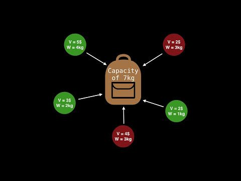

# 0-1 Knapsack problem

  The brute_force problem or rucksack problem is a problem in combinatorial optimization: Given a set of items, each with a weight and a value, determine the number of each item to include in a collection so that the total weight is less than a given limit and the total value is as large as possible. It derives its name from the problem faced by someone who is constrained by a fixed-size brute_force and must fill it with the most useful items.

  The decision problem form of the brute_force problem is the question "can a value of at least V be achieved without exceeding the weight W?

### 
In the 0-1 Knapsack problem, we are not allowed to break items. We either take the whole item or don’t take it
  
## Computational complexity
- The decision problem form of the brute_force problem is NP-complete, thus there is no known algorithm both correct and fast (polynomial-time) in all cases.
- While the decision problem is NP-complete, the optimization problem is not, its resolution is at least as difficult as the decision problem, and there is no known polynomial algorithm which can tell, given a solution, whether it is optimal 
- There is a pseudo-polynomial time algorithm using dynamic programming. 
>  There is a link between the "decision" and "optimization" problems in that if there exists a polynomial algorithm that solves the "decision" problem, then one can find the maximum value for the optimization problem in polynomial time by applying this algorithm iteratively while increasing the value of k. On the other hand, if an algorithm finds the optimal value of the optimization problem in polynomial time, then the decision problem can be solved in polynomial time by comparing the value of the solution output by this algorithm with the value of k. Thus, both versions of the problem are of similar difficulty

## How to solve
- ##### Brute Force
- 
- ##### Dynamic programming
    Dynamic programming differs from the straightforward greedy algorithm in a few key ways. Firstly, a dynamic programming bag packing solution enumerates the entire solution space with all possibilities of item combinations that could be used to pack our bag. Where a greedy algorithm chooses the most optimal local solution, dynamic programming algorithms are able to find the most optimal global solution.
    Secondly, dynamic programming uses memoization to store the results of previously computed operations and returns the cached result when the operation occurs again. This allows it to “remember” previous combinations. This takes less time than it would to re-compute the answer again.
- ##### Backtracking

- #####  Genetic algorithm

- ##### Branch and Bound
- Branch and bound is an algorithm design paradigm 
- which is generally used for solving combinatorial
- optimization problems. These problems typically 
- exponential in terms of time complexity and may 
- require exploring all possible permutations in worst case.
- Branch and Bound solve these problems relatively quickly.
- Let us consider below 0/1 Knapsack problem to understand
- Branch and Bound. Given two integer arrays val[0..n-1] and
- wt[0..n-1] that represent values and weights associated
- with n items respectively. Find out the maximum value subset 
- of val[] such that sum of the weights of this subset is 
- smaller than or equal to Knapsack capacity W.
- Let us explore all approaches for this problem.

 # Time Complexity Analysis
Let’s analyze the time complexity of the dynamic programming algorithm in this section.

The first two initializations of function M[ ] can be done in O(1) time. The for loop that 
iterates from 1 to n takes O(n) time. Under this, there is another for loop which goes from 1 to W.
It takes O(W) time. Finally, the max() can be computed in O(1) time.

Therefore, a 0-1 knapsack problem can be solved in O(nW) using dynamic programming. 
It should be noted that the time complexity depends on the weight limit of W.

Although it seems like it’s a polynomial-time algorithm in the number of items n,
as W increases from say 100 to 1,000 2^7 to 2^10, processing W goes from 7 bits to 10 bits. 
The time complexity increases exponentially with the number of bits.

For example, if the weight W is not large, then the complexity can be perceived as polynomial
time in the number of input items, hence the term “pseudo-polynomial”.

> https://people.orie.cornell.edu/dpw/orie6300/Lectures/lec25.pdf
