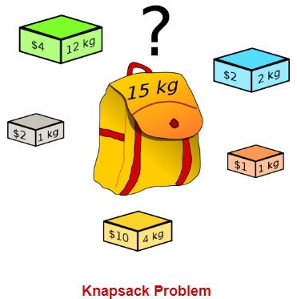

# Knapsack problem

In the knapsack problem, you need to pack a set of items, with given values and sizes (such as weights or volumes), into a container with a maximum capacity. If the total size of the items exceeds the capacity, you can't pack them all. In that case, the problem is to choose a subset of the items of maximum total value that will fit in the container.

## Computational complexity
- The decision problem form of the knapsack problem is NP-complete, thus there is no known algorithm both correct and fast (polynomial-time) in all cases.
- While the decision problem is NP-complete, the optimization problem is not, its resolution is at least as difficult as the decision problem, and there is no known polynomial algorithm which can tell, given a solution, whether it is optimal 
- There is a pseudo-polynomial time algorithm using dynamic programming. 
>  There is a link between the "decision" and "optimization" problems in that if there exists a polynomial algorithm that solves the "decision" problem, then one can find the maximum value for the optimization problem in polynomial time by applying this algorithm iteratively while increasing the value of k. On the other hand, if an algorithm finds the optimal value of the optimization problem in polynomial time, then the decision problem can be solved in polynomial time by comparing the value of the solution output by this algorithm with the value of k. Thus, both versions of the problem are of similar difficulty

## How to solve

- ##### Greedy algorithm
    A greedy algorithm is the most straightforward approach to solving the knapsack problem, in that it is a one-pass algorithm that constructs a single final solution. At each stage of the problem, the greedy algorithm picks the option that is locally optimal, meaning it looks like the most suitable option right now. It does not revise its previous choices as it progresses through our data set.
- #####brute force

  

- ##### Dynamic programming
    Dynamic programming differs from the straightforward greedy algorithm in a few key ways. Firstly, a dynamic programming bag packing solution enumerates the entire solution space with all possibilities of item combinations that could be used to pack our bag. Where a greedy algorithm chooses the most optimal local solution, dynamic programming algorithms are able to find the most optimal global solution.
    Secondly, dynamic programming uses memoization to store the results of previously computed operations and returns the cached result when the operation occurs again. This allows it to “remember” previous combinations. This takes less time than it would to re-compute the answer again.

### NP-Complete Problems and General Strategy

> https://people.orie.cornell.edu/dpw/orie6300/Lectures/lec25.pdf
